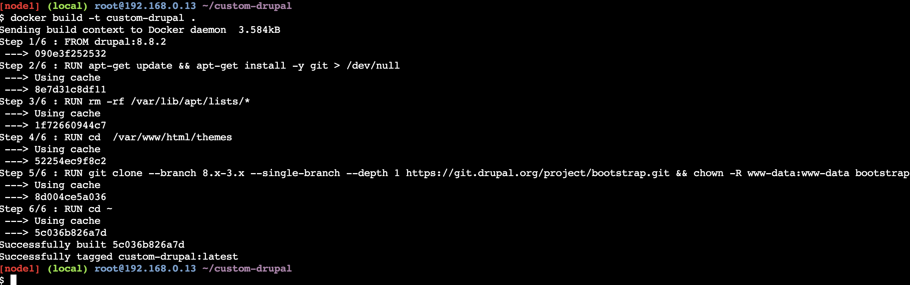
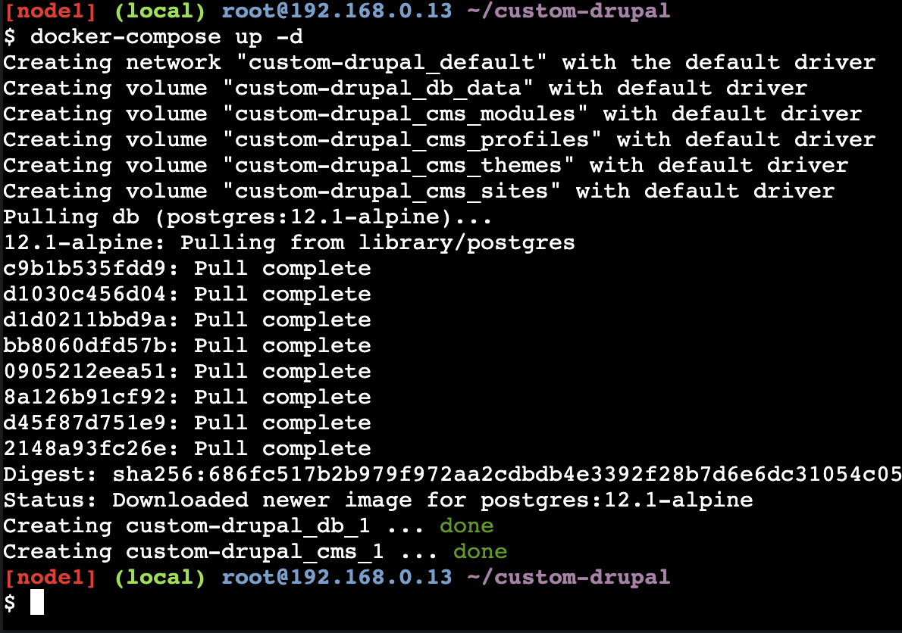
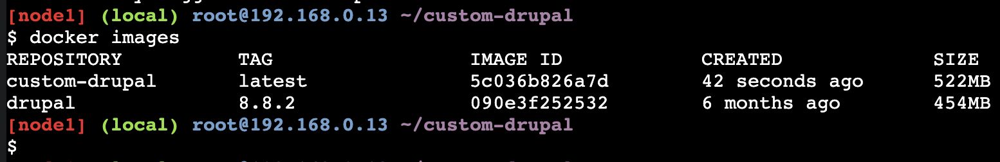
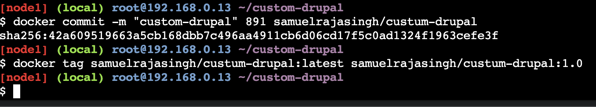
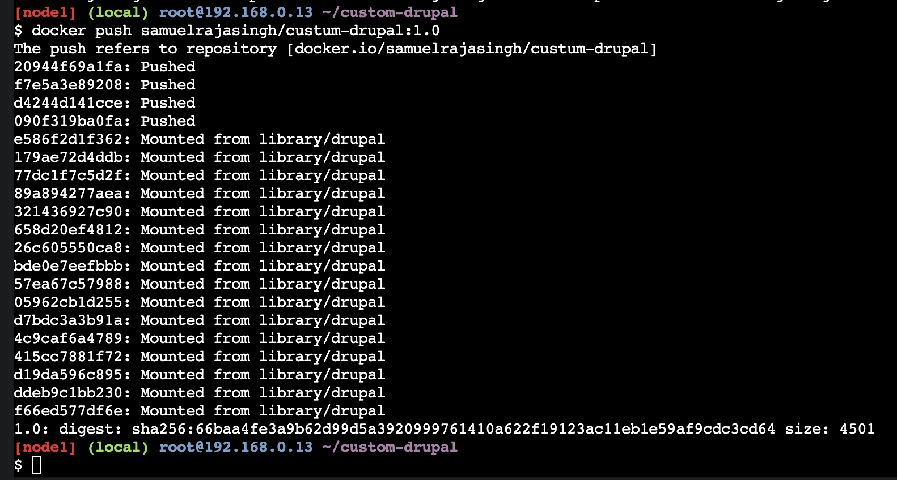
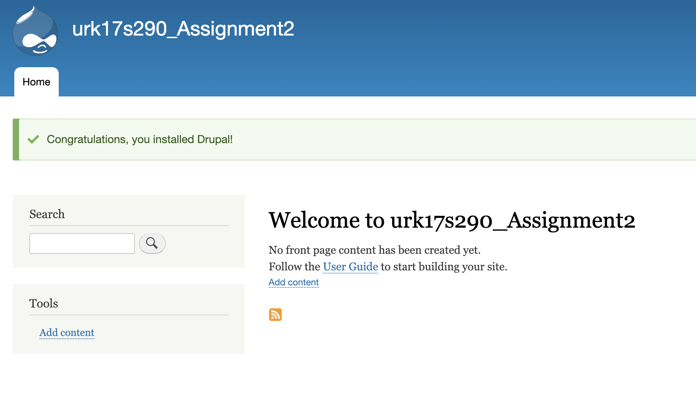

# Custom drupal image
### The Image is at hub.docker.com. You can get it @ [here](https://hub.docker.com/repository/docker/samuelrajasingh/custum-drupal) 
## Creating containers from Dockerfile

```bash
[node1] (local) root@192.168.0.13 ~
$ mkdir ~/custom-drupal/
[node1] (local) root@192.168.0.13 ~
$ cd ~/custom-drupal/
[node1] (local) root@192.168.0.13 ~/custom-drupal
```
Creating Dockerfile<br>
the Dockerfile is available [here](./drupal-container/Dockerfile)

```bash
vi Dockerfile
```
Build custom-image

```bash
docker build -t custom-drupal .
```
Creating Docker-compose file<br>
the compose file is available [here](./drupal-container/docker-compose.yaml)
```bash
[node1] (local) root@192.168.0.13 ~/custom-drupal
$ vi docker-compose.yml
```
Starting container,
```bash
[node1] (local) root@192.168.0.13 ~/custom-drupal
$ docker-compose up -d
```
List all containers
```bash
docker ps -a
```
Commit and tag the custom-image
```bash
docker commit -m "custom-drupal" 891 samuelrajasingh/custum-drupal
docker tag samuelrajasingh/custum-drupal:latest samuelrajasingh/custum-drupal:1.0
```
Push to docker hub
```bash
$ docker push samuelrajasingh/custum-drupal:1.0
```

Now goto port 8080 on the host ip and configure drupal
### Outputs :






<strong>Final Outcome:</strong>

