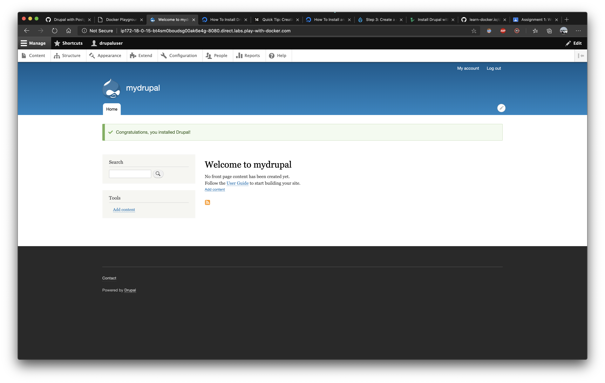
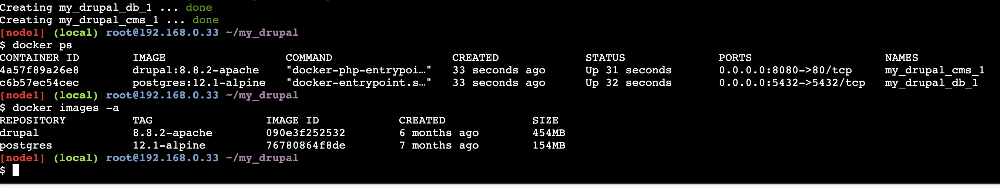

# Docker-compose
## Drupal-Postgres config

```bash
[node1] (local) root@192.168.0.33 ~
$ mkdir ~/my_drupal/
[node1] (local) root@192.168.0.33 ~
$ cd ~/my_drupal/
[node1] (local) root@192.168.0.33 ~/my_drupal
```
Creating Docker-compose file
```
[node1] (local) root@192.168.0.33 ~/my_drupal
$ vi docker-compose.yml
```

See the docker-compose.yml file (here)[./docker-compose.yaml]


Run the containers

```
[node1] (local) root@192.168.0.33 ~/my_drupal
$ docker-compose up -d
```

Now goto port 8080 on the host ip and configure drupal

The drupal config looks like this





